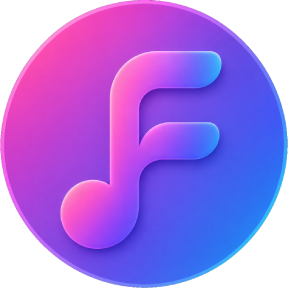
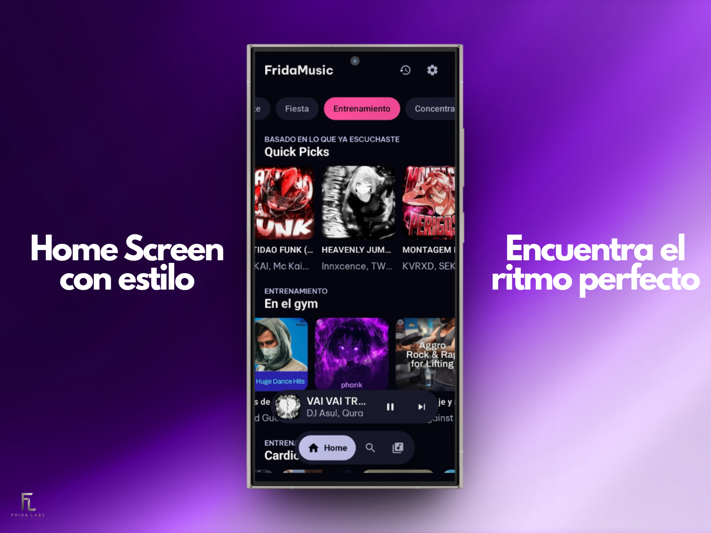
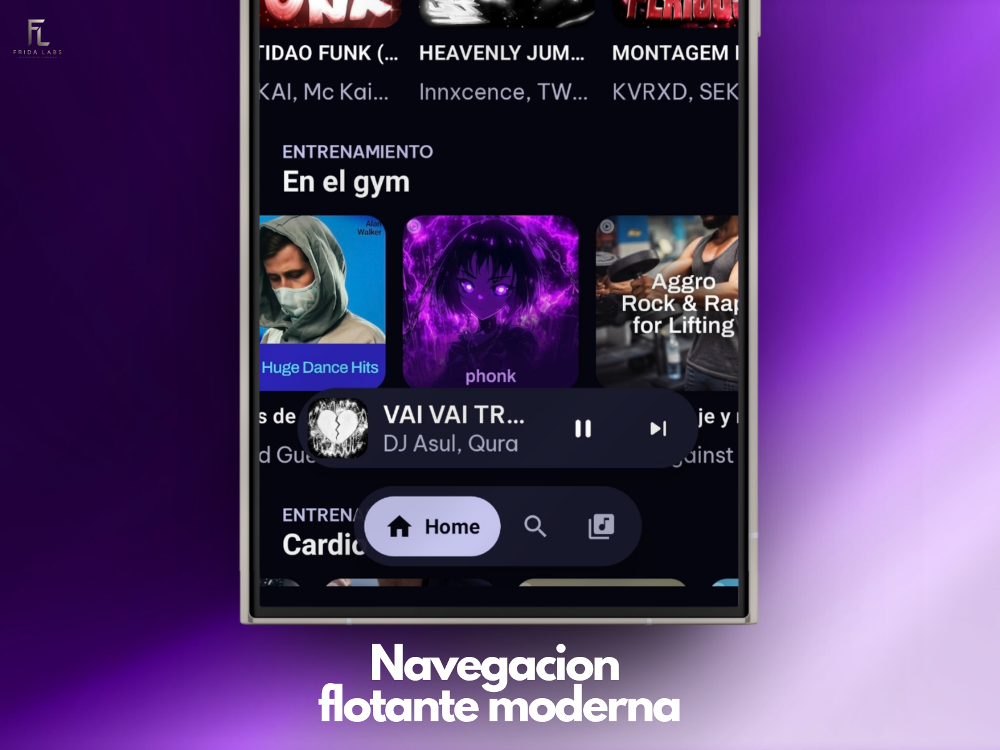
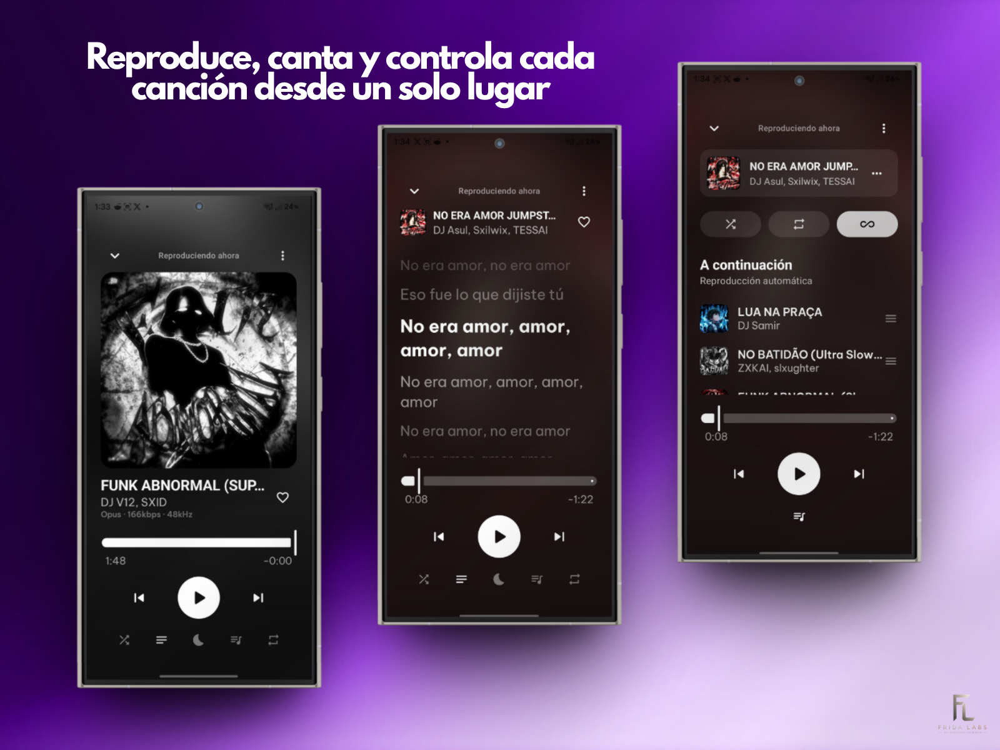
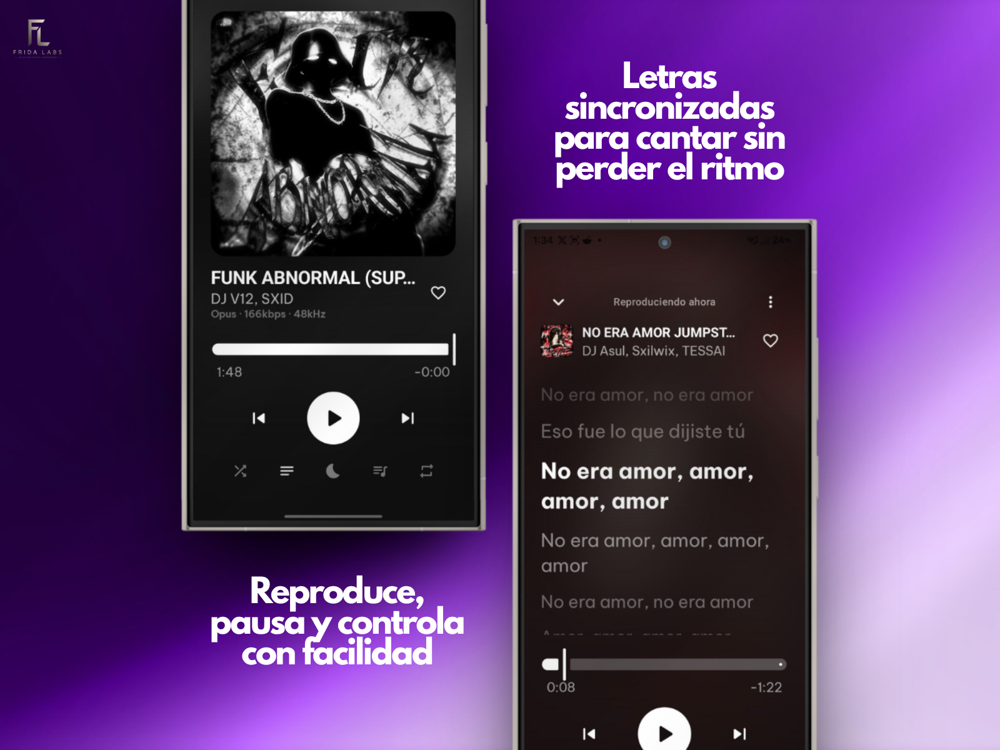
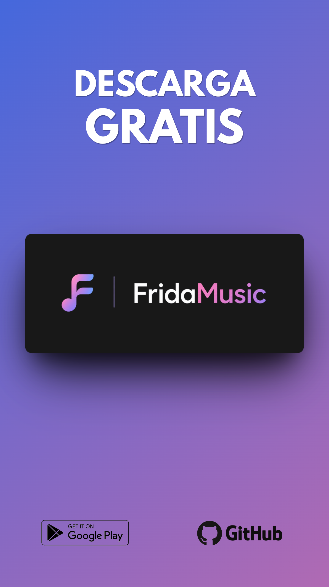

# FridaMusic

<p align="center">
  
</p>

<p align="center">
  <strong>Tu música. Tu biblioteca. Tu experiencia.</strong><br />
  Reproductor musical moderno para Android desarrollado por <strong>Frida Labs</strong>.
</p>

<p align="center">
  <a href="https://github.com/jagrdev-MX/FridaMusic_OF/releases"></a>
  <a href="https://github.com/jagrdev-MX/FridaMusic_OF/blob/master/LICENSE"></a>
  <a href="https://github.com/jagrdev-MX/FridaMusic_OF/stargazers"></a>
  <a href="https://github.com/jagrdev-MX/FridaMusic_OF/network/members"></a>
</p>

<p align="center">
  <a href="https://www.android.com/"></a>
  <a href="https://kotlinlang.org/"></a>
  <a href="https://isocpp.org/"></a>
  <a href="https://www.python.org/"></a>
  <a href="https://gradle.org/"></a>
  <a href="https://cmake.org/"></a>
</p>

<p align="center">
  <a href="https://play.google.com/store/apps/details?id=com.jagr.fridamusic"><strong>▶ Google Play</strong></a>
  &nbsp;&nbsp;•&nbsp;&nbsp;
  <a href="https://github.com/jagrdev-MX/FridaMusic_OF/releases"><strong>⬇ GitHub Releases</strong></a>
  &nbsp;&nbsp;•&nbsp;&nbsp;
  <a href="https://play.google.com/apps/testing/com.jagr.fridamusic"><strong>🧪 Beta abierta</strong></a>
  &nbsp;&nbsp;•&nbsp;&nbsp;
  <a href="https://frida-music-of.vercel.app/"><strong>🌐 Sitio oficial</strong></a>
</p>

---

## Acerca de FridaMusic

**FridaMusic** es una aplicación Android enfocada en reproducir música local y contenido remoto desde una interfaz moderna basada en **Jetpack Compose** y **Material 3**.

El proyecto incluye biblioteca, búsqueda, playlists, letras, reconocimiento musical, estadísticas de escucha, herramientas para compartir canciones, controles multimedia del sistema y distintas variantes de distribución.

El repositorio es modular: la aplicación principal vive en `app/` y los conectores de contenido, letras, arte, vídeo y reconocimiento se mantienen en módulos independientes. Las variantes de Android se definen en Gradle para separar distribuciones **FOSS**, **GMS** y **GitHub**.

FridaMusic forma parte del ecosistema de **Frida Labs**, continúa en desarrollo activo y se publica como proyecto **open source bajo GNU General Public License v3.0 (GPL-3.0)**.

---

## ✨ Características

- 🎵 **Biblioteca local** basada en el contenido de audio disponible en el dispositivo.
- 🔎 **Búsqueda y navegación musical** de canciones, artistas, álbumes, videos y playlists.
- 📚 **Biblioteca personalizada** con favoritos, playlists, álbumes, artistas y listas.
- 🎧 **Reproductor completo** con AndroidX Media3/ExoPlayer, cola, autoplay, sesión multimedia, notificaciones y widgets.
- 📝 **Letras sincronizadas** mediante proveedores intercambiables y experiencia tipo karaoke cuando existe contenido compatible.
- 🎤 **Reconocimiento musical** mediante el flujo de reconocimiento de FridaMusic y código nativo.
- 🔀 **Aleatorio global** para descubrir y reproducir contenido desde distintas fuentes compatibles.
- 📊 **FridaMusic Recap** semanal, mensual y anual con estadísticas de escucha.
- 📤 **Compartir música** mediante enlaces, códigos QR y tarjetas visuales.
- 📱 **Tarjetas para redes sociales** con diferentes estilos de presentación.
- 🔔 **Notificaciones y recomendaciones** relacionadas con la actividad musical.
- 💾 **Copia de seguridad y restauración** de los datos compatibles.
- 🔄 **Actualizaciones mediante Google Play** en las distribuciones compatibles.
- 🎨 **Temas claro, oscuro y del sistema**, junto con opciones de personalización visual.
- ⚙️ **Ecualizador, temporizador de suspensión, crossfade, gapless** y otros ajustes de reproducción.
- 📺 **Integraciones opcionales** según variante, como Google Cast, Firebase, Google Play Services y Billing.
- ⚡ **Optimización continua de rendimiento y estabilidad**, incluida la gestión de bibliotecas locales grandes.

---

## 📸 Capturas

Las siguientes imágenes son recursos visuales originales proporcionados para la presentación pública del proyecto.

### Toda tu música, sin límites

<p align="center">
  
</p>

<table>
  <tr>
    <td align="center" width="50%">
      <strong>Home con estilo</strong><br />
      
    </td>
    <td align="center" width="50%">
      <strong>Navegación flotante moderna</strong><br />
      
    </td>
  </tr>
  <tr>
    <td align="center" width="50%">
      <strong>Reproductor, letras y cola</strong><br />
      
    </td>
    <td align="center" width="50%">
      <strong>Control y letras sincronizadas</strong><br />
      
    </td>
  </tr>
</table>

### Descarga FridaMusic

<p align="center">
  
</p>

---

## 📥 Descargas oficiales

| Canal | Uso recomendado |
| --- | --- |
| [Google Play](https://play.google.com/store/apps/details?id=com.jagr.fridamusic) | Distribución oficial mediante Google Play |
| [GitHub Releases](https://github.com/jagrdev-MX/FridaMusic_OF/releases) | APKs y releases públicos del proyecto |
| [Beta abierta](https://play.google.com/apps/testing/com.jagr.fridamusic) | Acceso a versiones de prueba disponibles mediante Google Play |
| [Sitio oficial](https://frida-music-of.vercel.app/) | Información, enlaces y recursos públicos |

> [!IMPORTANT]
> Descarga FridaMusic únicamente desde canales oficiales publicados por Frida Labs.

---

## 📊 FridaMusic Recap

FridaMusic puede generar resúmenes de actividad musical para ayudar a visualizar cómo se escucha música dentro de la aplicación.

Los Recaps pueden estar disponibles en periodos:

- **Semanal**
- **Mensual**
- **Anual**

Según los datos disponibles, pueden mostrar tiempo de escucha, reproducciones, canciones, artistas, álbumes y otros elementos destacados. Los Recaps también pueden compartirse mediante tarjetas o imágenes generadas por la aplicación.

---

## 🛠 Tecnología

Los badges superiores identifican lenguajes y herramientas realmente presentes en el checkout. Las versiones mostradas provienen del catálogo de versiones y de la configuración Gradle actual del proyecto.

| Área | Tecnologías comprobadas en el repositorio |
| --- | --- |
| Lenguajes y build | Kotlin, Kotlin DSL, C++, CMake, Python para verificación y Gradle Wrapper |
| Android/UI | Android SDK 36, Jetpack Compose 1.10.2, Material 3 1.5.0-alpha18, AndroidX Lifecycle y Navigation Compose |
| Reproducción | AndroidX Media3/ExoPlayer 1.7.1, MediaSession, HLS y Media3 UI; Cast se añade en variantes GMS |
| Persistencia | Room 2.8.4 sobre SQLite, DataStore Preferences y KSP |
| Inyección y concurrencia | Hilt 2.59.1, Kotlin Coroutines/Flow y WorkManager |
| Red y multimedia | Ktor 3.4.0, Retrofit 2.11.0, OkHttp, Coil 3.3.0, Protobuf y FFmpegKit Audio |
| Integraciones | Firebase en variantes GMS seleccionadas, Google Play Services/Billing, proveedores de contenido y letras en módulos separados |

Referencias oficiales: [Kotlin](https://kotlinlang.org/docs/home.html), [Jetpack Compose](https://developer.android.com/jetpack/compose), [Material 3](https://m3.material.io/), [Media3](https://developer.android.com/media/media3), [Room](https://developer.android.com/training/data-storage/room), [Hilt](https://dagger.dev/hilt/), [Ktor](https://ktor.io/), [Retrofit](https://square.github.io/retrofit/), [Coil](https://coil-kt.github.io/coil/), [Protobuf](https://protobuf.dev/), [WorkManager](https://developer.android.com/develop/background-work/background-tasks/persistent/getting-started), [Gradle](https://docs.gradle.org/current/userguide/userguide.html) y [CMake](https://cmake.org/cmake/help/latest/).

---

## 🧩 Estructura del repositorio

| Ruta | Responsabilidad |
| --- | --- |
| `app/` | Aplicación Android, UI Compose, playback, base de datos, servicios y variantes de distribución |
| `app/src/main/cpp/` | Código nativo C++ y puentes JNI para reconocimiento/procesamiento de audio |
| `innertube/`, `jiosaavn/`, `kugou/`, `lrclib/`, `betterlyrics/`, `paxsenixlyrics/`, `simpmusic/`, `youlyplus/`, `unison/` | Módulos de proveedores de contenido o letras |
| `canvas/`, `echomusiccanvas/`, `applecanvas/`, `artistvideo/`, `shazamkit/` | Módulos auxiliares de arte, vídeo y reconocimiento |
| `docs/` | Documentación del proyecto y auditorías técnicas |
| `docs/assets/` | Assets públicos usados por la documentación; consulta su [guía de organización](docs/assets/README.md) |
| `gradle/libs.versions.toml` | Catálogo central de versiones y dependencias |

---

## 🔓 Estado del código fuente

**FridaMusic es un proyecto open source.**

El código fuente publicado por sus respectivos titulares en este repositorio se distribuye bajo la **GNU General Public License v3.0 (GPL-3.0)**.

El código puede utilizarse como:

- referencia técnica y material de aprendizaje;
- base comunitaria para forks y trabajos derivados compatibles con la licencia;
- punto de partida para contribuciones;
- código abierto para estudiar, modificar y redistribuir conforme a GPL-3.0.

El desarrollo moderno de FridaMusic continúa bajo **Frida Labs** y el código fuente actual se mantiene en este repositorio.

> [!IMPORTANT]
> La GPL-3.0 aplica al código de FridaMusic publicado por sus titulares. Dependencias, componentes, assets y archivos de terceros conservan sus propias licencias, avisos de copyright y condiciones de distribución cuando corresponda.

---

## 🧰 Compilar desde código fuente

### Requisitos

- Android Studio compatible con el Android Gradle Plugin configurado.
- **JDK 21**; el proyecto compila y apunta a JVM 21.
- Android SDK con **API 36**.
- Configuración local para las credenciales o servicios opcionales que requiera la variante elegida.

### Clonar y preparar

```bash
git clone https://github.com/jagrdev-MX/FridaMusic_OF.git
cd FridaMusic_OF
```

No subas `local.properties`, contraseñas, tokens ni claves. Para la configuración inicial puedes revisar [`gradle.properties.template`](gradle.properties.template); los valores de firma deben permanecer fuera del control de versiones.

### Compilar una variante FOSS de depuración

```bash
./gradlew :app:assembleUniversalFossDebug
```

En Windows:

```bat
gradlew.bat :app:assembleUniversalFossDebug
```

También existen variantes `Gms` y `Github`, además de salidas por ABI (`arm64`, `armeabi`, `x86` y `x86_64`). Los artefactos se generan en `app/build/outputs/`.

---

## ❤️ Apoya FridaMusic

FridaMusic es un proyecto independiente desarrollado por **Frida Labs**. Si disfrutas la aplicación y quieres apoyar su desarrollo, mantenimiento y futuras mejoras, puedes hacerlo de forma completamente voluntaria.

### Google Play

Las distribuciones compatibles de Google Play pueden ofrecer aportes voluntarios mediante **Google Play Billing**.

### GitHub / PayPal

Las distribuciones publicadas mediante GitHub permiten apoyar directamente mediante PayPal:

**PayPal:**  
https://paypal.me/JAGRDEVELOPER?locale.x=es_XC&country.x=MX

> [!NOTE]
> Los aportes son completamente opcionales. No desbloquean funciones, contenido exclusivo, membresías ni características premium.

---

## 🌐 Comunidad

Únete a los canales oficiales para seguir el desarrollo, compartir sugerencias o participar con la comunidad:

- 📢 **Telegram:** https://t.me/FridaLabs
- 💬 **Discord:** https://discord.gg/Gyh7nfWK9k
- 💚 **WhatsApp:** https://chat.whatsapp.com/CrZyvVqoLPq6QGTbJSSrAX
- 🐛 **Issues:** https://github.com/jagrdev-MX/FridaMusic_OF/issues

---

## 🔐 Privacidad y soporte

- 🌐 **Sitio oficial:** https://frida-music-of.vercel.app/
- 🔐 **Política de privacidad:** https://frida-music-of.vercel.app/privacy
- 📦 **Releases oficiales:** https://github.com/jagrdev-MX/FridaMusic_OF/releases
- 🐛 **Reportes y sugerencias:** https://github.com/jagrdev-MX/FridaMusic_OF/issues

Para soporte comunitario también puedes utilizar Telegram, Discord o WhatsApp desde los enlaces anteriores.

---

## 🤝 Contribuciones

Las contribuciones, reportes y propuestas son bienvenidos mediante Issues y pull requests.

Puedes colaborar con:

- código fuente de la aplicación;
- correcciones de errores;
- mejoras de rendimiento y estabilidad;
- documentación;
- pruebas y QA;
- nuevos proveedores o integraciones compatibles;
- página web y recursos públicos;
- propuestas de nuevas funcionalidades.

Para contribuir:

1. Haz fork del repositorio.
2. Crea una rama específica para tu cambio.
3. Conserva la separación entre variantes y módulos.
4. Evita incluir credenciales, secretos o recursos con restricciones de distribución.
5. Utiliza commits claros; **Conventional Commits** es bienvenido cuando aplique.
6. Abre un pull request explicando el alcance del cambio y cómo fue probado.

Las contribuciones aceptadas deberán ser compatibles con la licencia **GPL-3.0** del proyecto y respetar las licencias de cualquier componente de terceros utilizado.

---

## 📈 Contribuciones automáticas

<!-- CONTRIBUTOR-STATS:START -->
_Esta sección se actualiza automáticamente con GitHub Actions._

### Repositorio oficial

**Commits humanos visibles:** 113 · **Commits de automatización externos:** 0

| Colaborador | Commits | % de contribución humana |
| --- | ---: | ---: |
| [@jagrdev-MX](https://github.com/jagrdev-MX) | 93 | 82.3% |
| [@juliocps25](https://github.com/juliocps25) | 20 | 17.7% |

### Forks con trabajo independiente

**Forks inspeccionados:** 2 · **Forks activos:** 0

| Fork | Rama | Commits por delante | % de actividad independiente | Último push |
| --- | --- | ---: | ---: | --- |
| Sin forks activos detectados | — | 0 | 0.0% | — |

> Los porcentajes del repositorio oficial se calculan con commits humanos visibles. Los bots se separan para no distorsionar la métrica. Los forks muestran trabajo independiente que aún no necesariamente fue integrado al proyecto principal.

Última actualización automática (UTC): `2026-09-10`
<!-- CONTRIBUTOR-STATS:END -->

---

## ⚖️ Aviso legal

FridaMusic y Frida Labs son proyectos independientes.

FridaMusic no está afiliado, patrocinado, autorizado ni respaldado por YouTube, YouTube Music, Google LLC u otros servicios externos compatibles con la aplicación.

Las marcas, nombres comerciales, logotipos, contenido y servicios mencionados pertenecen a sus respectivos propietarios.

El uso de servicios externos está sujeto a sus respectivos términos, disponibilidad y condiciones.

---

## 📄 Licencia y propiedad intelectual

El código fuente de **FridaMusic** publicado por sus respectivos titulares en este repositorio se distribuye bajo la **GNU General Public License v3.0 (GPL-3.0)**.

Consulta:

- [LICENSE](LICENSE)
- [GNU General Public License v3.0](https://www.gnu.org/licenses/gpl-3.0.html)

La GPL-3.0 permite utilizar, estudiar, modificar y redistribuir el código conforme a sus términos y exige preservar las libertades y obligaciones correspondientes en los trabajos derivados cubiertos por la licencia.

Los componentes de terceros incluidos o utilizados por FridaMusic conservan sus respectivas licencias, atribuciones, avisos de copyright y condiciones aplicables.

Los nombres **FridaMusic™** y **Frida Labs™**, junto con sus logotipos, identidad visual, recursos gráficos y demás elementos de marca, forman parte de la identidad del proyecto y no quedan concedidos como marca por la licencia del código fuente.

---

<p align="center">
  <strong>FridaMusic</strong> forma parte del ecosistema de <strong>Frida Labs</strong>.<br />
  Hecho con ❤️ para la comunidad de FridaMusic.
</p>
